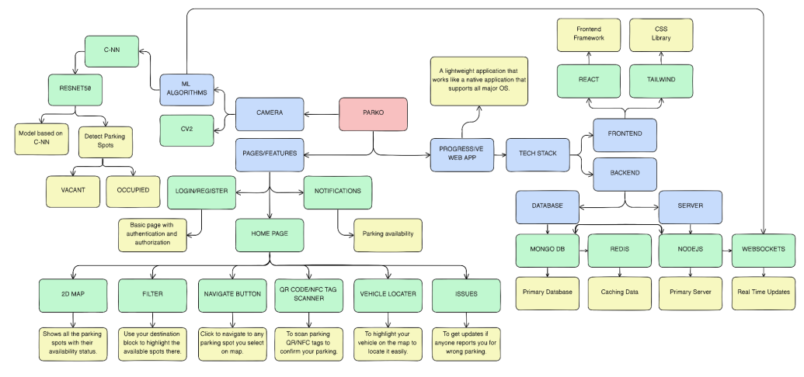
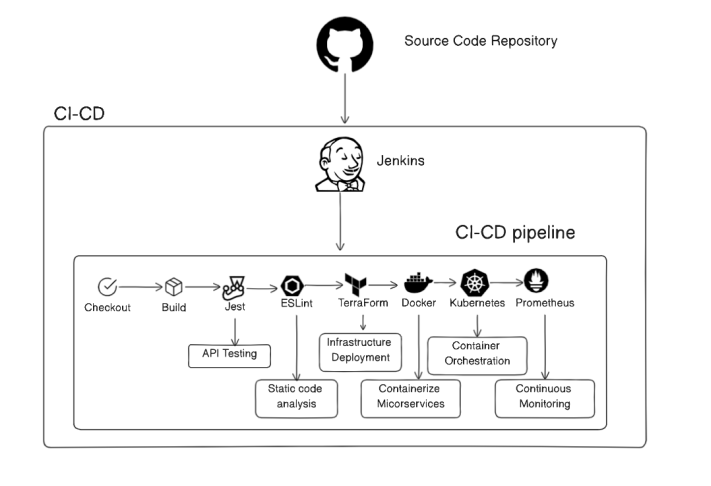
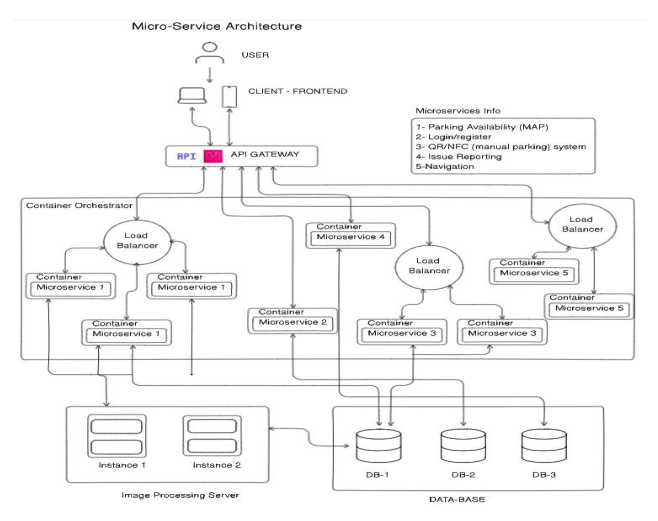
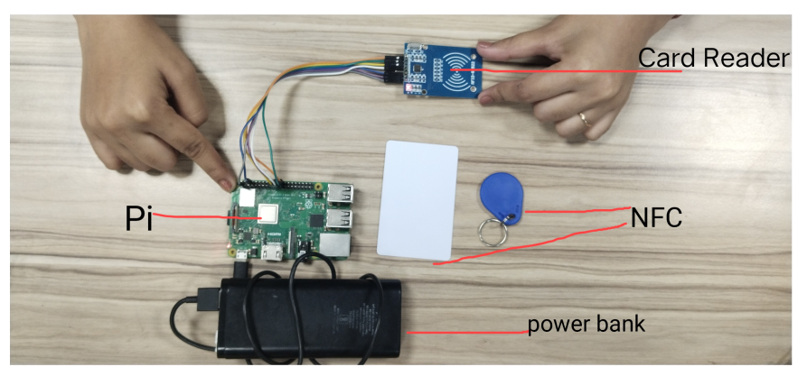

# Parko Backend

The backend of the Parko application is responsible for handling the core functionalities such as managing parking data, processing real-time updates, and integrating with the image processing server for accurate parking spot detection.

## Features

- **Real-Time Data Processing**: Handle real-time updates from IoT cameras and sensors.
- **AI/ML Integration**: Use advanced AI/ML models to predict parking spot availability and provide recommendations.
- **REST API**: Provide endpoints for frontend interaction and data management.
- **Security**: Integrate with security cameras and use QR/NFC tags for data accuracy.

## Application Workflow Diagram



## DevOps Implementation Diagram



## MicroServices Diagram



## Raspberry Pi Setup



## Tech Stack

- **Node.js**: JavaScript runtime for building scalable network applications.
- **Express.js**: Web application framework for Node.js.
- **MongoDB**: NoSQL database for storing parking data.
- **OpenCV**: Library for image processing.

## Installation

1. Clone the repository:

   ```bash
   git clone https://github.com/Ayroid/PARKO-Frontend.git
   ```

2. Navigate to the project directory:

   ```bash
    cd PARKO-Frontend
   ```

3. Install dependencies:

   ```bash
    npm install
   ```

4. Start the development server:
   ```bash
    npm run dev
   ```

## Usage

- Open your browser and go to http://localhost:3000 to view the application.
- Use the interactive map to check parking availability.
- Pre-book a parking spot or let the system automatically assign one.

## Contributing

We welcome contributions to improve Parko. To contribute, follow these steps:

- Fork the repository.
- Create a new branch (git checkout -b feature-branch).
- Make your changes.
- Commit your changes (git commit -m 'Add some feature').
- Push to the branch (git push origin feature-branch).
- Open a pull request.

## License

This project is licensed under the MIT License - see the LICENSE file for details.
